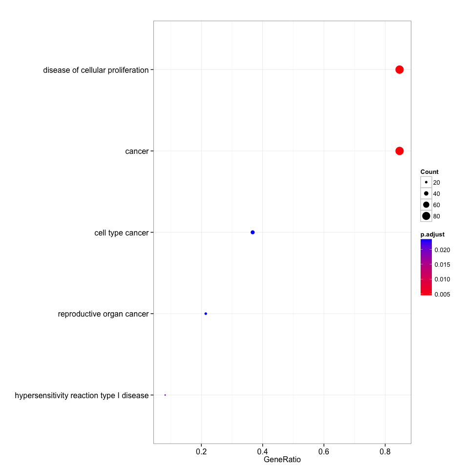
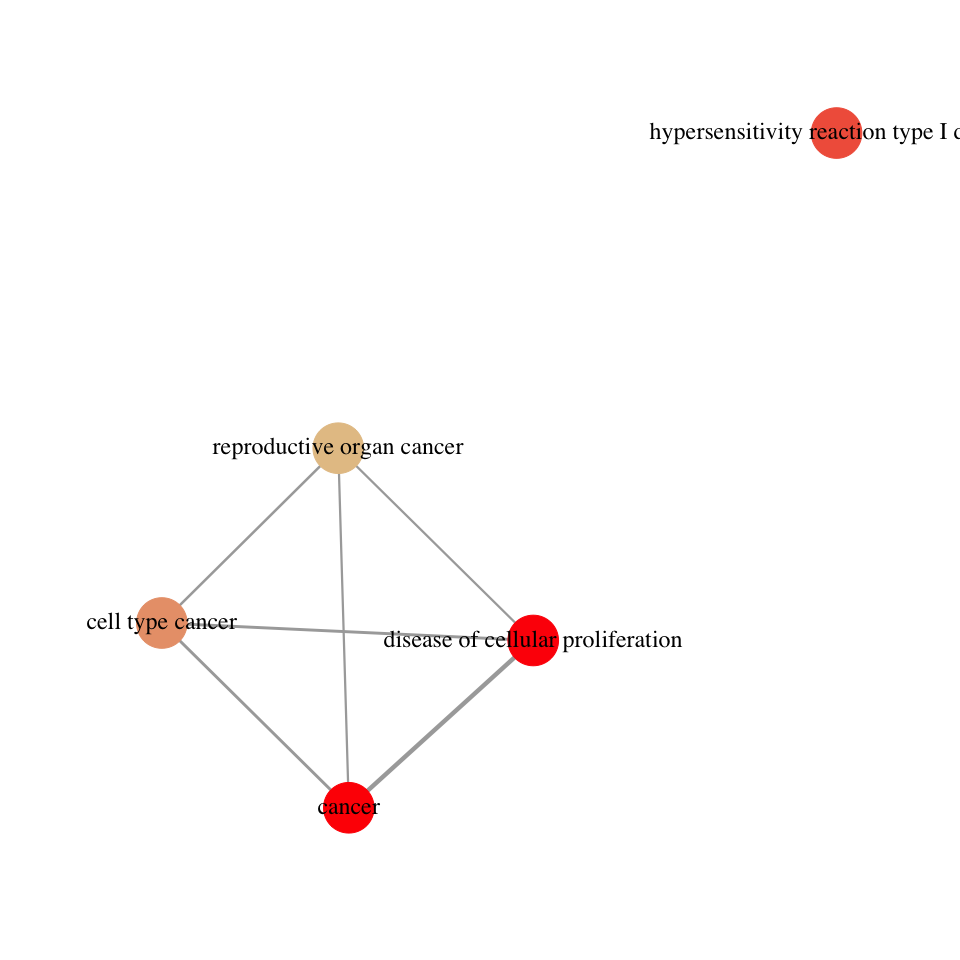
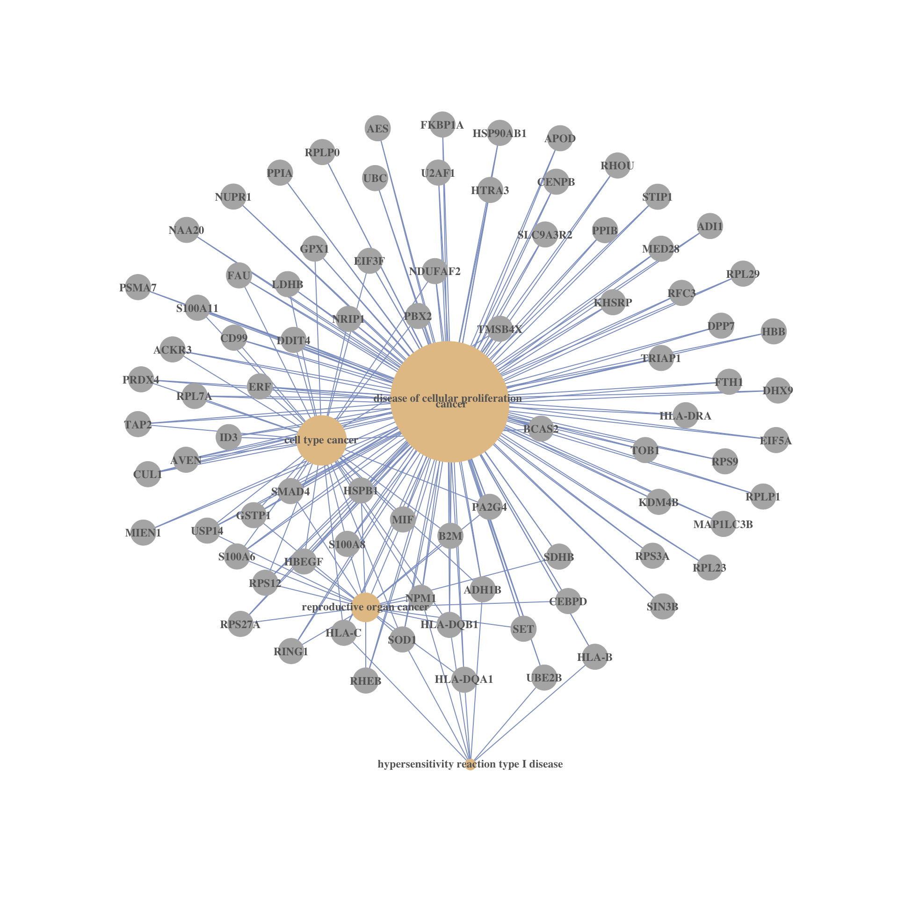

DO enrichment analysis with DOSE
--------------------------------

    require(DOSE)

    load("cache/gene.rda")
    eg=bitr(gene, "ENSEMBL", "ENTREZID", "org.Hs.eg.db")[, "ENTREZID"]

    ## Warning in bitr(gene, "ENSEMBL", "ENTREZID", "org.Hs.eg.db"): 2.83% of
    ## input gene IDs are fail to map...

    do <- enrichDO(eg, readable=TRUE)

    summary(do)

    ##                        ID                              Description
    ## DOID:162         DOID:162                                   cancer
    ## DOID:14566     DOID:14566        disease of cellular proliferation
    ## DOID:1205       DOID:1205 hypersensitivity reaction type I disease
    ## DOID:0050687 DOID:0050687                         cell type cancer
    ## DOID:193         DOID:193                reproductive organ cancer
    ##              GeneRatio   BgRatio       pvalue    p.adjust      qvalue
    ## DOID:162         83/98 5190/8018 8.195540e-06 0.004066717 0.003445486
    ## DOID:14566       83/98 5247/8018 1.525973e-05 0.004066717 0.003445486
    ## DOID:1205         8/98  122/8018 1.144757e-04 0.020338511 0.017231601
    ## DOID:0050687     36/98 1664/8018 1.813292e-04 0.023254255 0.019701936
    ## DOID:193         21/98  748/8018 2.181450e-04 0.023254255 0.019701936
    ##                                                                                                                                                                                                                                                                                                                                                                                                                                                                                                            geneID
    ## DOID:162     CD99/CUL1/SLC9A3R2/GSTP1/KHSRP/FKBP1A/RPLP0/HSP90AB1/PSMA7/USP14/AES/ERF/HSPB1/RHEB/LDHB/RPS12/HBEGF/RHOU/BCAS2/SDHB/ID3/MED28/UBE2B/SET/PRDX4/RPL23/CENPB/SIN3B/KDM4B/EIF5A/RFC3/DHX9/RPLP1/MAP1LC3B/TOB1/SMAD4/MIEN1/SOD1/S100A8/RPS27A/ACKR3/RPS3A/RPL7A/FAU/UBC/U2AF1/RPL29/S100A11/NDUFAF2/B2M/PPIB/FTH1/DDIT4/STIP1/AVEN/PA2G4/HTRA3/TRIAP1/RPS9/NAA20/EIF3F/NUPR1/DPP7/HLA-DQB1/NRIP1/NPM1/ADI1/APOD/PPIA/ADH1B/HLA-DQA1/S100A6/RING1/TAP2/HLA-DRA/PBX2/HLA-C/TMSB4X/CEBPD/GPX1/HLA-B/MIF/HBB
    ## DOID:14566   CD99/CUL1/SLC9A3R2/GSTP1/KHSRP/FKBP1A/RPLP0/HSP90AB1/PSMA7/USP14/AES/ERF/HSPB1/RHEB/LDHB/RPS12/HBEGF/RHOU/BCAS2/SDHB/ID3/MED28/UBE2B/SET/PRDX4/RPL23/CENPB/SIN3B/KDM4B/EIF5A/RFC3/DHX9/RPLP1/MAP1LC3B/TOB1/SMAD4/MIEN1/SOD1/S100A8/RPS27A/ACKR3/RPS3A/RPL7A/FAU/UBC/U2AF1/RPL29/S100A11/NDUFAF2/B2M/PPIB/FTH1/DDIT4/STIP1/AVEN/PA2G4/HTRA3/TRIAP1/RPS9/NAA20/EIF3F/NUPR1/DPP7/HLA-DQB1/NRIP1/NPM1/ADI1/APOD/PPIA/ADH1B/HLA-DQA1/S100A6/RING1/TAP2/HLA-DRA/PBX2/HLA-C/TMSB4X/CEBPD/GPX1/HLA-B/MIF/HBB
    ## DOID:1205                                                                                                                                                                                                                                                                                                                                                                                                                                                     UBE2B/SOD1/HLA-DQB1/NPM1/ADH1B/HLA-DQA1/HLA-C/HLA-B
    ## DOID:0050687                                                                                                                                                                                                                                                                                       CD99/CUL1/GSTP1/USP14/ERF/HSPB1/LDHB/RPS12/HBEGF/BCAS2/ID3/PRDX4/SMAD4/SOD1/S100A8/ACKR3/RPL7A/FAU/S100A11/NDUFAF2/B2M/DDIT4/AVEN/PA2G4/EIF3F/HLA-DQB1/NRIP1/NPM1/ADH1B/S100A6/TAP2/PBX2/HLA-C/TMSB4X/GPX1/MIF
    ## DOID:193                                                                                                                                                                                                                                                                                                                                                                             GSTP1/USP14/HSPB1/RHEB/RPS12/HBEGF/SDHB/SET/SMAD4/SOD1/S100A8/RPS27A/B2M/PA2G4/HLA-DQB1/NPM1/HLA-DQA1/S100A6/RING1/CEBPD/MIF
    ##              Count
    ## DOID:162        83
    ## DOID:14566      83
    ## DOID:1205        8
    ## DOID:0050687    36
    ## DOID:193        21

    dotplot(do)

    enrichMap(do)

    cnetplot(do)

Session info
------------

    date()

    ## [1] "Fri Jul 17 14:56:28 2015"

    sessionInfo()

    ## R version 3.2.1 (2015-06-18)
    ## Platform: x86_64-apple-darwin14.3.0 (64-bit)
    ## Running under: OS X 10.10.4 (Yosemite)
    ## 
    ## locale:
    ## [1] en_US.UTF-8/en_US.UTF-8/en_US.UTF-8/C/en_US.UTF-8/en_US.UTF-8
    ## 
    ## attached base packages:
    ## [1] stats4    parallel  stats     graphics  grDevices utils     datasets 
    ## [8] methods   base     
    ## 
    ## other attached packages:
    ##  [1] org.Hs.eg.db_3.1.2     DO.db_2.9              RDAVIDWebService_1.6.0
    ##  [4] ggplot2_1.0.1          GOstats_2.34.0         Category_2.34.2       
    ##  [7] GO.db_3.1.2            AnnotationDbi_1.30.1   GenomeInfoDb_1.4.1    
    ## [10] IRanges_2.2.5          S4Vectors_0.6.1        Matrix_1.2-2          
    ## [13] Biobase_2.28.0         BiocGenerics_0.14.0    graph_1.46.0          
    ## [16] clusterProfiler_2.3.6  DOSE_2.7.9             RSQLite_1.0.0         
    ## [19] DBI_0.3.1              rmarkdown_0.7          roxygen2_4.1.1        
    ## [22] magrittr_1.5           BiocInstaller_1.18.3  
    ## 
    ## loaded via a namespace (and not attached):
    ##  [1] KEGGREST_1.8.0         qvalue_2.0.0           genefilter_1.50.0     
    ##  [4] reshape2_1.4.1         rJava_0.9-6            splines_3.2.1         
    ##  [7] lattice_0.20-31        colorspace_1.2-6       htmltools_0.2.6       
    ## [10] XML_3.98-1.3           RBGL_1.44.0            survival_2.38-3       
    ## [13] topGO_2.20.0           plyr_1.8.3             stringr_1.0.0         
    ## [16] zlibbioc_1.14.0        Biostrings_2.36.1      munsell_0.4.2         
    ## [19] GOSemSim_1.27.4        gtable_0.1.2           evaluate_0.7          
    ## [22] labeling_0.3           knitr_1.10.5           SparseM_1.6           
    ## [25] GSEABase_1.30.2        proto_0.3-10           Rcpp_0.11.6           
    ## [28] xtable_1.7-4           scales_0.2.5           formatR_1.2           
    ## [31] annotate_1.46.1        XVector_0.8.0          png_0.1-7             
    ## [34] digest_0.6.8           stringi_0.4-1          grid_3.2.1            
    ## [37] tools_3.2.1            MASS_7.3-42            httr_1.0.0            
    ## [40] AnnotationForge_1.10.1 R6_2.1.0               igraph_1.0.1
