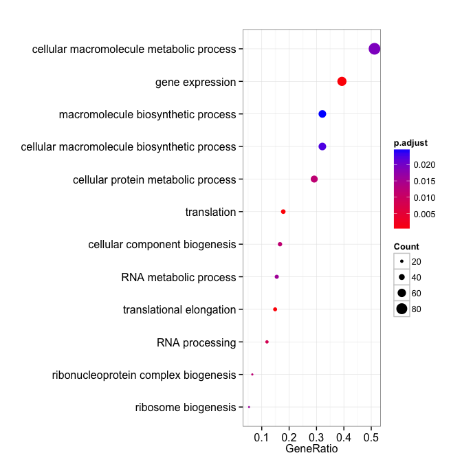
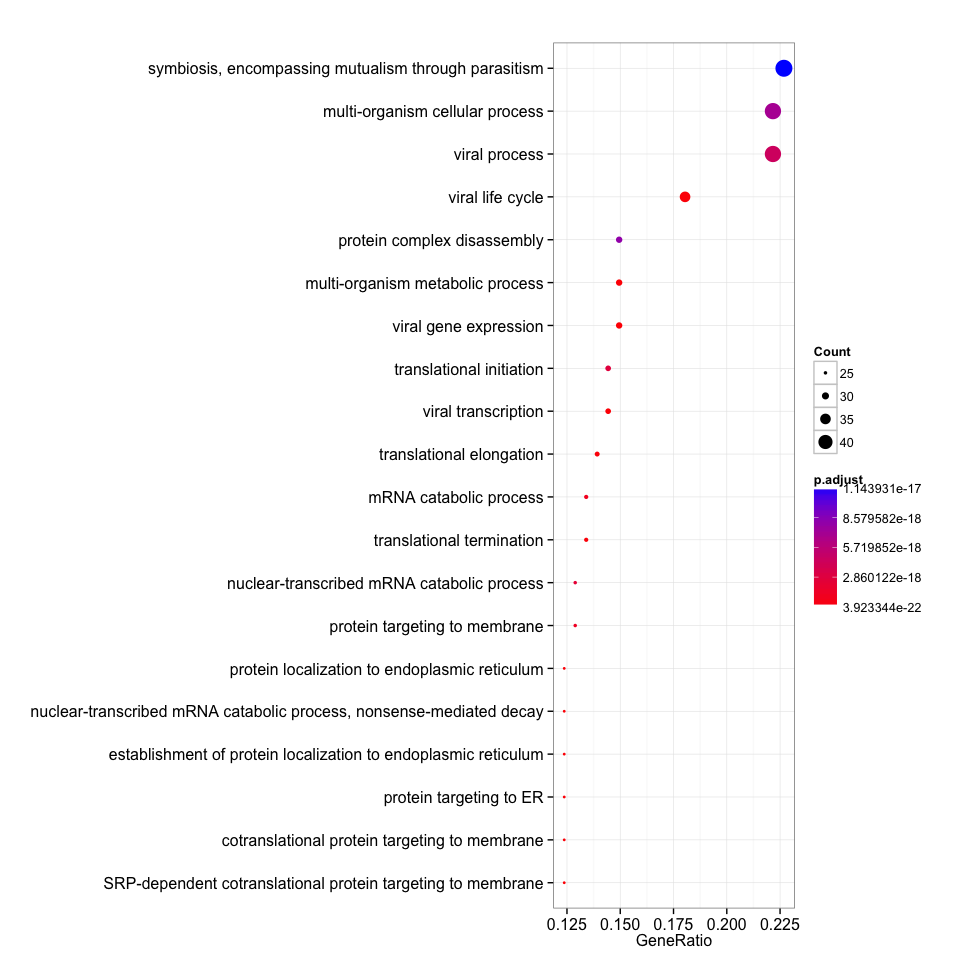
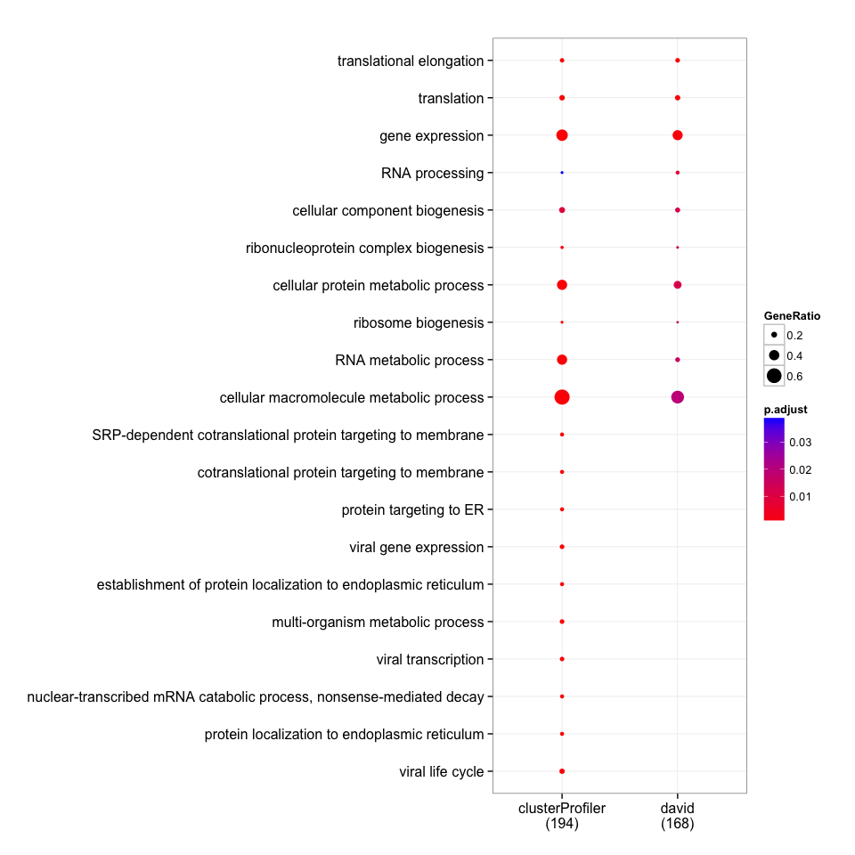

GO (BP) enrichment with DAVID
-----------------------------

    require(magrittr)
    require(DOSE)
    require(RDAVIDWebService)
    require(clusterProfiler)

    david_bp <- enrichDAVID(gene, idType="ENSEMBL_GENE_ID", annotation="GOTERM_BP_ALL", david.user="gcyu@connect.hku.hk")

    summary(david_bp)[, -8]

    ##                    ID                                      Description
    ## GO:0006414 GO:0006414                         translational elongation
    ## GO:0006412 GO:0006412                                      translation
    ## GO:0010467 GO:0010467                                  gene expression
    ## GO:0006396 GO:0006396                                   RNA processing
    ## GO:0044085 GO:0044085                    cellular component biogenesis
    ## GO:0022613 GO:0022613             ribonucleoprotein complex biogenesis
    ## GO:0044267 GO:0044267               cellular protein metabolic process
    ## GO:0042254 GO:0042254                              ribosome biogenesis
    ## GO:0016070 GO:0016070                            RNA metabolic process
    ## GO:0044260 GO:0044260         cellular macromolecule metabolic process
    ## GO:0034645 GO:0034645      cellular macromolecule biosynthetic process
    ## GO:0009059 GO:0009059               macromolecule biosynthetic process
    ## GO:0006397 GO:0006397                                  mRNA processing
    ## GO:0032268 GO:0032268 regulation of cellular protein metabolic process
    ##            GeneRatio    BgRatio       pvalue     p.adjust       qvalue
    ## GO:0006414    25/168  101/14116 4.833921e-25 6.298599e-22 9.718725e-23
    ## GO:0006412    30/168  331/14116 1.916789e-17 1.248788e-14 1.926877e-15
    ## GO:0010467    66/168 2999/14116 1.313901e-07 5.706548e-05 8.805443e-06
    ## GO:0006396    20/168  547/14116 2.561454e-05 8.309328e-03 1.287468e-03
    ## GO:0044085    28/168 1001/14116 4.549872e-05 1.178722e-02 1.829527e-03
    ## GO:0022613    11/168  180/14116 5.566722e-05 1.201662e-02 1.844751e-03
    ## GO:0044267    49/168 2355/14116 6.422825e-05 1.188482e-02 1.844751e-03
    ## GO:0042254     9/168  122/14116 9.956471e-05 1.608661e-02 2.434515e-03
    ## GO:0016070    26/168  938/14116 1.089796e-04 1.565485e-02 2.434515e-03
    ## GO:0044260    86/168 5214/14116 1.478656e-04 1.908386e-02 2.972876e-03
    ## GO:0034645    54/168 2812/14116 1.896884e-04 2.222098e-02 3.467032e-03
    ## GO:0009059    54/168 2832/14116 2.282688e-04 2.448429e-02 3.824503e-03
    ## GO:0006397    13/168  321/14116 4.392293e-04 4.307854e-02 6.792939e-03
    ## GO:0032268    16/168  474/14116 5.095183e-04 4.632629e-02 7.317143e-03
    ##            Count
    ## GO:0006414    25
    ## GO:0006412    30
    ## GO:0010467    66
    ## GO:0006396    20
    ## GO:0044085    28
    ## GO:0022613    11
    ## GO:0044267    49
    ## GO:0042254     9
    ## GO:0016070    26
    ## GO:0044260    86
    ## GO:0034645    54
    ## GO:0009059    54
    ## GO:0006397    13
    ## GO:0032268    16

    dotplot(david_bp, showCategory=12)

GO (BP) enrichment with clusterProfiler
---------------------------------------

    eg=bitr(gene, "ENSEMBL", "ENTREZID", "org.Hs.eg.db")[, "ENTREZID"]
    clusterProfiler_bp <- enrichGO(eg, ont="BP")

    head(summary(clusterProfiler_bp)[, -8])

    ##                    ID
    ## GO:0006614 GO:0006614
    ## GO:0006613 GO:0006613
    ## GO:0045047 GO:0045047
    ## GO:0019080 GO:0019080
    ## GO:0072599 GO:0072599
    ## GO:0044033 GO:0044033
    ##                                                               Description
    ## GO:0006614    SRP-dependent cotranslational protein targeting to membrane
    ## GO:0006613                  cotranslational protein targeting to membrane
    ## GO:0045047                                        protein targeting to ER
    ## GO:0019080                                          viral gene expression
    ## GO:0072599 establishment of protein localization to endoplasmic reticulum
    ## GO:0044033                               multi-organism metabolic process
    ##            GeneRatio   BgRatio       pvalue     p.adjust       qvalue
    ## GO:0006614    24/194 108/18585 1.975510e-25 3.923344e-22 3.349772e-22
    ## GO:0006613    24/194 110/18585 3.183361e-25 3.923344e-22 3.349772e-22
    ## GO:0045047    24/194 112/18585 5.078427e-25 3.923344e-22 3.349772e-22
    ## GO:0019080    29/194 199/18585 5.520006e-25 3.923344e-22 3.349772e-22
    ## GO:0072599    24/194 116/18585 1.256069e-24 7.142007e-22 6.097883e-22
    ## GO:0044033    29/194 209/18585 2.336069e-24 8.598730e-22 7.341641e-22
    ##            Count
    ## GO:0006614    24
    ## GO:0006613    24
    ## GO:0045047    24
    ## GO:0019080    29
    ## GO:0072599    24
    ## GO:0044033    29

    dotplot(clusterProfiler_bp, showCategory=20)

Compare GO (BP) enrichment result obtained from DAVID and clusterProfiler
-------------------------------------------------------------------------

    merge_result(list(david=david_bp, clusterProfiler=clusterProfiler_bp)) %>%
        plot(., showCategory=10)

    summary(david_bp)[, "ID"] %in% summary(clusterProfiler_bp)[, "ID"]

    ##  [1] TRUE TRUE TRUE TRUE TRUE TRUE TRUE TRUE TRUE TRUE TRUE TRUE TRUE TRUE

-   DAVID only annotate 168 genes, while clusterProfiler can annotate
    194 genes of the gene list with 212 genes in total.
-   DAVID enrich 14 BP terms, while clusterProfiler enrich 222 BP terms.
-   All enriched terms reported in DAVID were also reported by
    clusterProfiler.

Session info
------------

    date()

    ## [1] "Fri Jul 17 14:36:17 2015"

    sessionInfo()

    ## R version 3.2.1 (2015-06-18)
    ## Platform: x86_64-apple-darwin14.3.0 (64-bit)
    ## Running under: OS X 10.10.4 (Yosemite)
    ## 
    ## locale:
    ## [1] en_US.UTF-8/en_US.UTF-8/en_US.UTF-8/C/en_US.UTF-8/en_US.UTF-8
    ## 
    ## attached base packages:
    ## [1] stats4    parallel  stats     graphics  grDevices utils     datasets 
    ## [8] methods   base     
    ## 
    ## other attached packages:
    ##  [1] RDAVIDWebService_1.6.0 ggplot2_1.0.1          GOstats_2.34.0        
    ##  [4] Category_2.34.2        GO.db_3.1.2            AnnotationDbi_1.30.1  
    ##  [7] GenomeInfoDb_1.4.1     IRanges_2.2.5          S4Vectors_0.6.1       
    ## [10] Matrix_1.2-2           Biobase_2.28.0         BiocGenerics_0.14.0   
    ## [13] graph_1.46.0           clusterProfiler_2.3.6  DOSE_2.7.9            
    ## [16] RSQLite_1.0.0          DBI_0.3.1              rmarkdown_0.7         
    ## [19] roxygen2_4.1.1         magrittr_1.5           BiocInstaller_1.18.3  
    ## 
    ## loaded via a namespace (and not attached):
    ##  [1] KEGGREST_1.8.0         qvalue_2.0.0           genefilter_1.50.0     
    ##  [4] reshape2_1.4.1         rJava_0.9-6            splines_3.2.1         
    ##  [7] lattice_0.20-31        colorspace_1.2-6       htmltools_0.2.6       
    ## [10] XML_3.98-1.3           RBGL_1.44.0            survival_2.38-3       
    ## [13] topGO_2.20.0           plyr_1.8.3             stringr_1.0.0         
    ## [16] zlibbioc_1.14.0        Biostrings_2.36.1      munsell_0.4.2         
    ## [19] GOSemSim_1.27.4        gtable_0.1.2           evaluate_0.7          
    ## [22] labeling_0.3           knitr_1.10.5           SparseM_1.6           
    ## [25] GSEABase_1.30.2        proto_0.3-10           Rcpp_0.11.6           
    ## [28] xtable_1.7-4           scales_0.2.5           formatR_1.2           
    ## [31] DO.db_2.9              annotate_1.46.1        XVector_0.8.0         
    ## [34] png_0.1-7              digest_0.6.8           stringi_0.4-1         
    ## [37] grid_3.2.1             tools_3.2.1            MASS_7.3-42           
    ## [40] httr_1.0.0             AnnotationForge_1.10.1 R6_2.1.0              
    ## [43] igraph_1.0.1
