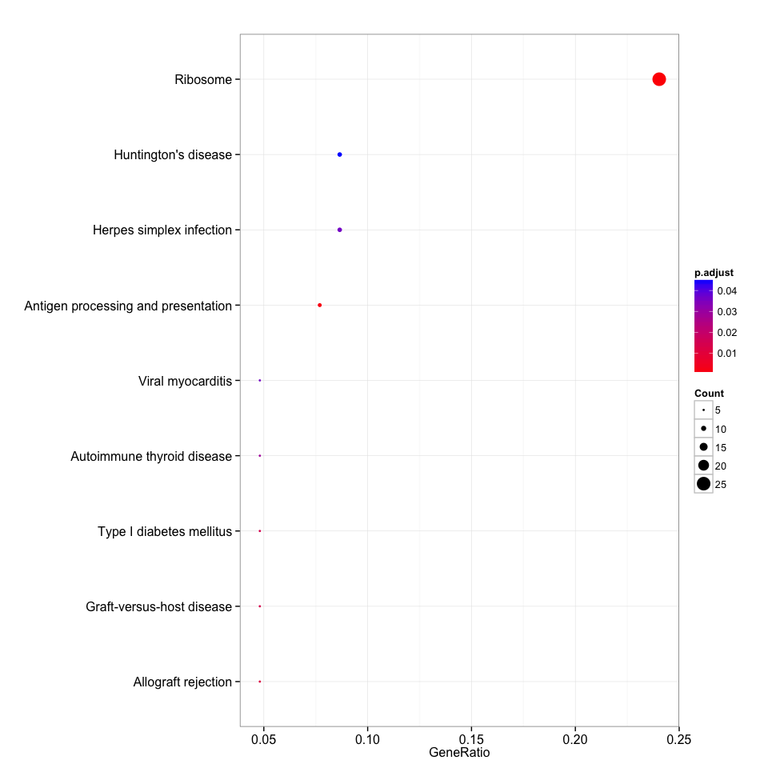
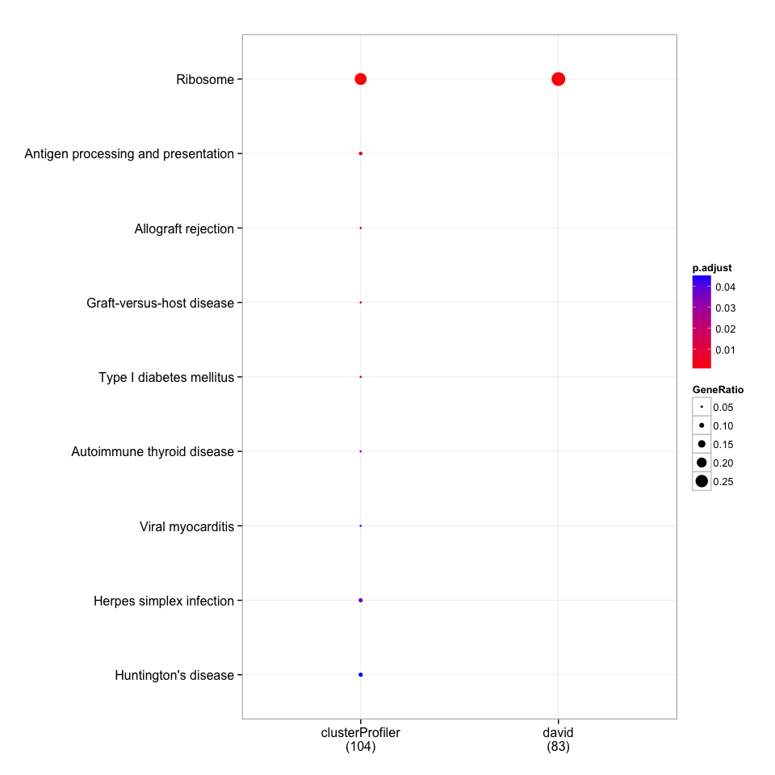

KEGG enrichment with DAVID
--------------------------

    require(magrittr)
    require(DOSE)
    require(RDAVIDWebService)
    require(clusterProfiler)

    load("cache/gene.rda")
    david_KEGG <- enrichDAVID(gene, idType="ENSEMBL_GENE_ID", annotation="KEGG_PATHWAY", david.user="gcyu@connect.hku.hk")

    summary(david_KEGG)[, -8]

    ##                ID Description GeneRatio BgRatio       pvalue     p.adjust
    ## hsa03010 hsa03010    Ribosome     23/83 87/5085 1.804017e-21 1.731856e-19
    ##                qvalue Count
    ## hsa03010 7.595859e-21    23

Ribosome is the only term reported by DAVID consistent with the result
reported in the supplemental file.

KEGG enrichment with clusterProfiler
------------------------------------

    eg=bitr(gene, "ENSEMBL", "ENTREZID", "org.Hs.eg.db")[, "ENTREZID"]
    clusterProfiler_KEGG <- enrichKEGG(eg)

    dim(summary(clusterProfiler_KEGG))

    ## [1] 9 9

    head(summary(clusterProfiler_KEGG)[, -8])

    ##                ID                         Description GeneRatio  BgRatio
    ## hsa03010 hsa03010                            Ribosome    25/104 137/6895
    ## hsa04612 hsa04612 Antigen processing and presentation     8/104  77/6895
    ## hsa05330 hsa05330                 Allograft rejection     5/104  37/6895
    ## hsa05332 hsa05332           Graft-versus-host disease     5/104  41/6895
    ## hsa04940 hsa04940            Type I diabetes mellitus     5/104  43/6895
    ## hsa05320 hsa05320          Autoimmune thyroid disease     5/104  52/6895
    ##                pvalue     p.adjust       qvalue Count
    ## hsa03010 6.111415e-21 1.008384e-18 9.392280e-19    25
    ## hsa04612 1.819033e-05 1.500702e-03 1.397783e-03     8
    ## hsa05330 2.105386e-04 1.157962e-02 1.078549e-02     5
    ## hsa05332 3.450666e-04 1.423400e-02 1.325782e-02     5
    ## hsa04940 4.327776e-04 1.428166e-02 1.330222e-02     5
    ## hsa05320 1.049593e-03 2.886381e-02 2.688432e-02     5

    dotplot(clusterProfiler_KEGG, showCategory=9)

Compare KEGG enrichment result obtained from DAVID and clusterProfiler
----------------------------------------------------------------------

    merge_result(list(david=david_KEGG, clusterProfiler=clusterProfiler_KEGG)) %>%
        plot(., showCategory=10)

-   DAVID's KEGG annotate 5085 genes in background while clusterProfiler
    use latest online version that annotate 6895 genes.
-   DAVID only annotate 83 genes, while clusterProfiler can annotate 104
    genes of the gene list with 212 genes in total.
-   DAVID enrich 1 KEGG terms, while clusterProfiler enrich 9 KEGG
    terms.
-   All enriched terms reported in DAVID were also reported by
    clusterProfiler.

Session info
------------

    date()

    ## [1] "Fri Jul 17 15:15:40 2015"

    sessionInfo()

    ## R version 3.2.1 (2015-06-18)
    ## Platform: x86_64-apple-darwin14.3.0 (64-bit)
    ## Running under: OS X 10.10.4 (Yosemite)
    ## 
    ## locale:
    ## [1] en_US.UTF-8/en_US.UTF-8/en_US.UTF-8/C/en_US.UTF-8/en_US.UTF-8
    ## 
    ## attached base packages:
    ## [1] stats4    parallel  stats     graphics  grDevices utils     datasets 
    ## [8] methods   base     
    ## 
    ## other attached packages:
    ##  [1] ReactomePA_1.13.2      org.Hs.eg.db_3.1.2     DO.db_2.9             
    ##  [4] RDAVIDWebService_1.6.0 ggplot2_1.0.1          GOstats_2.34.0        
    ##  [7] Category_2.34.2        GO.db_3.1.2            AnnotationDbi_1.30.1  
    ## [10] GenomeInfoDb_1.4.1     IRanges_2.2.5          S4Vectors_0.6.1       
    ## [13] Matrix_1.2-2           Biobase_2.28.0         BiocGenerics_0.14.0   
    ## [16] graph_1.46.0           clusterProfiler_2.3.6  DOSE_2.7.9            
    ## [19] RSQLite_1.0.0          DBI_0.3.1              rmarkdown_0.7         
    ## [22] roxygen2_4.1.1         magrittr_1.5           BiocInstaller_1.18.3  
    ## 
    ## loaded via a namespace (and not attached):
    ##  [1] KEGGREST_1.8.0         qvalue_2.0.0           genefilter_1.50.0     
    ##  [4] reshape2_1.4.1         rJava_0.9-6            splines_3.2.1         
    ##  [7] lattice_0.20-31        tcltk_3.2.1            graphite_1.15.0       
    ## [10] colorspace_1.2-6       htmltools_0.2.6        XML_3.98-1.3          
    ## [13] RBGL_1.44.0            survival_2.38-3        topGO_2.20.0          
    ## [16] plyr_1.8.3             stringr_1.0.0          zlibbioc_1.14.0       
    ## [19] Biostrings_2.36.1      munsell_0.4.2          GOSemSim_1.27.4       
    ## [22] gtable_0.1.2           evaluate_0.7           labeling_0.3          
    ## [25] knitr_1.10.5           SparseM_1.6            GSEABase_1.30.2       
    ## [28] proto_0.3-10           Rcpp_0.11.6            reactome.db_1.52.1    
    ## [31] xtable_1.7-4           scales_0.2.5           formatR_1.2           
    ## [34] annotate_1.46.1        XVector_0.8.0          png_0.1-7             
    ## [37] digest_0.6.8           stringi_0.4-1          grid_3.2.1            
    ## [40] tools_3.2.1            MASS_7.3-42            httr_1.0.0            
    ## [43] AnnotationForge_1.10.1 R6_2.1.0               igraph_1.0.1
