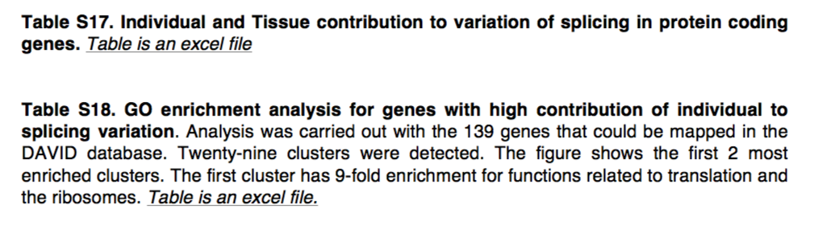
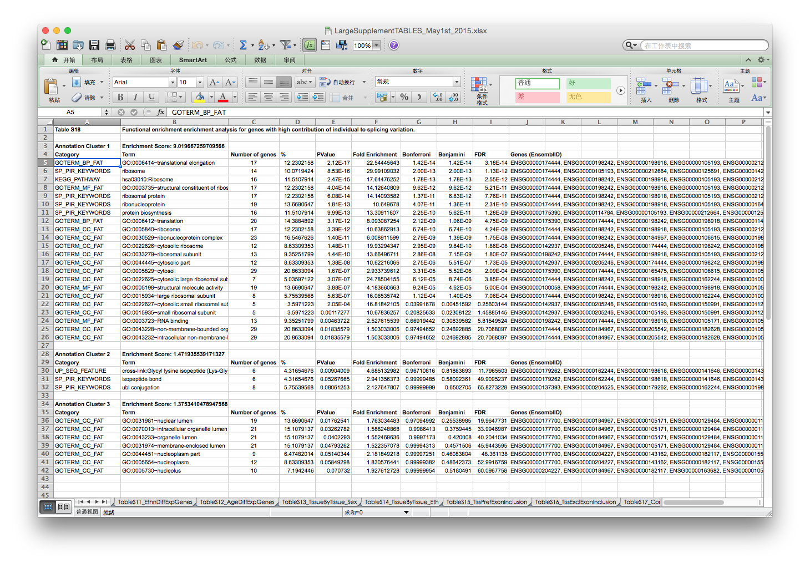
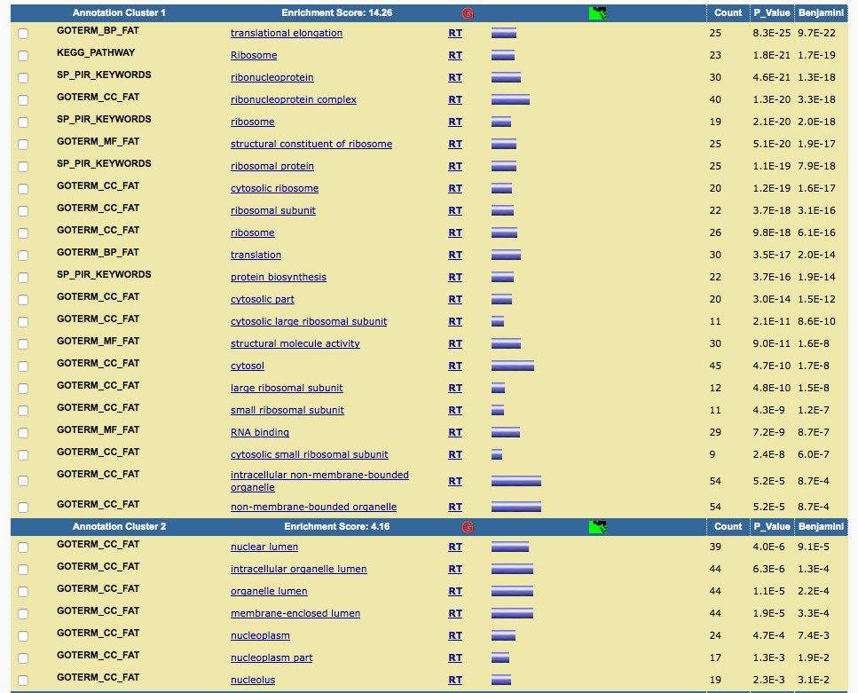
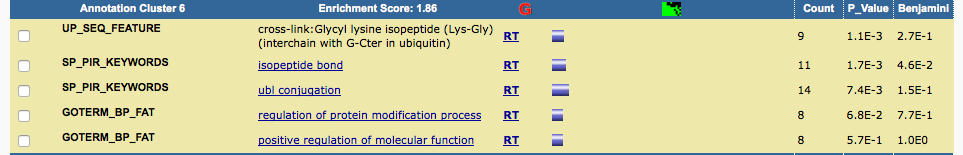

# functional enrichment for GTEx paper

### Guangchuang Yu
#### 07/15, 2015


Refer to the [issue](https://github.com/GuangchuangYu/DOSE/issues/6), this document will reproduce functional analysis using [DOSE](http://www.bioconductor/packages/DOSE) and [clusterProfiler](http://www.bioconductor.org/packages/clusterProfiler) packages.


The paper and supplemental files are located at [paper folder](paper).

In page 63 of [supplemental file](paper/Mele.SM.pdf), the authors mentioned that *genes with high contribution of individuals to splicing variation* were used in GO enrichment analysis.



The **Individual and Tissue contribution to variation of splicing** was stored in [supplemental table 17](paper/LargeSupplementTABLES_May1st_2015.xlsx), which was exported as a [csv file](tableS17.csv).


```{r}
require(magrittr)
require(DOSE)
require(RDAVIDWebService)
require(clusterProfiler)

table17 <- read.csv("paper/tableS17.csv")

gene <- with(table17, gene_id[ Individuals > quantile(Individuals, 0.98)])
gene %<>% as.character %>% gsub("\\.\\d+", "", .)

head(gene)
length(gene)
```

The authors did not mention how they define __*high contribution*__, here I use the top 2% of genes and get `r length(gene)` genes with 168 genes that could be mapped in the DAVID database. Slightly large than the number (139) reported in [supplemental file](paper/Mele.SM.pdf).

The GO enrichment result reported in [supplemental table 18](paper/LargeSupplementTABLES_May1st_2015.xlsx) is:




I pasted the genes into DAVID and got similar results.




Although the gene list I selected here is slighly different from the one author selected (which we don't know), it can reproduce the results reported in the paper.


```{r eval=F}
david_bp <- enrichDAVID(gene, idType="ENSEMBL_GENE_ID", annotation="GOTERM_BP_ALL", qvalueCutoff=0.05, david.user="gcyu@connect.hku.hk")
```

```{r echo=F}
load("david_bp.rda")
```

```{r fig.width=7, fig.height=7, fig.align='center'}
summary(david_bp)[, -8]
dotplot(david_bp, showCategory=12)
```

```{r eval=F}
eg=bitr(gene, "ENSEMBL", "ENTREZID", "org.Hs.eg.db")[, "ENTREZID"]
clusterProfiler_bp <- enrichGO(eg, ont="BP")
```

```{r echo=F}
load("clusterProfiler_bp.rda")
```

```{r fig.width=10, fig.height=10}
dotplot(clusterProfiler_bp, showCategory=20)
```


```{r fig.width=10, fig.height=10}
merge_result(list(david=david_bp, clusterProfiler=clusterProfiler_bp)) %>%
    plot(., showCategory=10)
```


## session info
```{r}
date()
sessionInfo()
```
