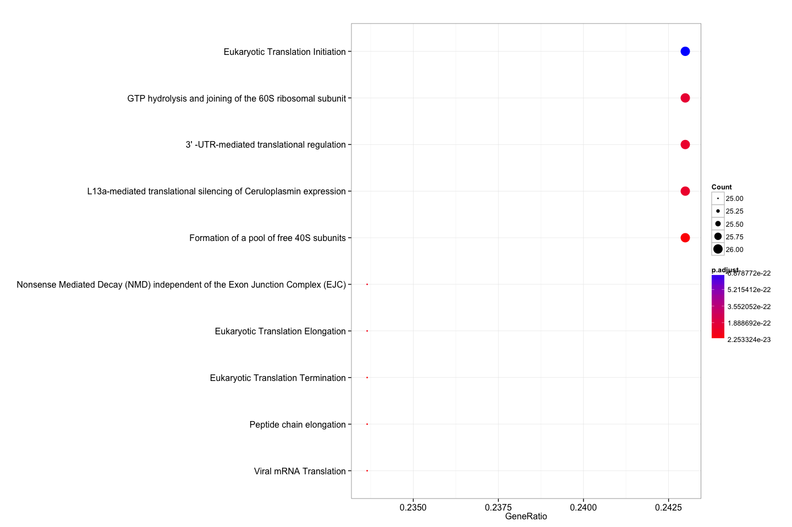

Reactome enrichment analysis with DOSE
--------------------------------------

    require(ReactomePA)

    load("cache/gene.rda")
    eg=bitr(gene, "ENSEMBL", "ENTREZID", "org.Hs.eg.db")[, "ENTREZID"]

    ## Warning in bitr(gene, "ENSEMBL", "ENTREZID", "org.Hs.eg.db"): 2.83% of
    ## input gene IDs are fail to map...

    rr <- enrichPathway(eg, readable=TRUE)

    dim(summary(rr))

    ## [1] 56  9

    head(summary(rr)[,-8])

    ##            ID
    ## 192823 192823
    ## 72689   72689
    ## 156902 156902
    ## 72764   72764
    ## 156842 156842
    ## 975956 975956
    ##                                                                         Description
    ## 192823                                                       Viral mRNA Translation
    ## 72689                                      Formation of a pool of free 40S subunits
    ## 156902                                                     Peptide chain elongation
    ## 72764                                            Eukaryotic Translation Termination
    ## 156842                                            Eukaryotic Translation Elongation
    ## 975956 Nonsense Mediated Decay (NMD) independent of the Exon Junction Complex (EJC)
    ##        GeneRatio BgRatio       pvalue     p.adjust       qvalue Count
    ## 192823    25/107 86/6750 7.462910e-26 2.253324e-23 1.627641e-23    25
    ## 72689     26/107 98/6750 9.994051e-26 2.253324e-23 1.627641e-23    26
    ## 156902    25/107 88/6750 1.428415e-25 2.253324e-23 1.627641e-23    25
    ## 72764     25/107 88/6750 1.428415e-25 2.253324e-23 1.627641e-23    25
    ## 156842    25/107 91/6750 3.659323e-25 4.618065e-23 3.335761e-23    25
    ## 975956    25/107 93/6750 6.710543e-25 7.057254e-23 5.097658e-23    25

    dotplot(rr)

    enrichMap(rr)

Session info
------------

    date()

    ## [1] "Fri Jul 17 15:12:02 2015"

    sessionInfo()

    ## R version 3.2.1 (2015-06-18)
    ## Platform: x86_64-apple-darwin14.3.0 (64-bit)
    ## Running under: OS X 10.10.4 (Yosemite)
    ## 
    ## locale:
    ## [1] en_US.UTF-8/en_US.UTF-8/en_US.UTF-8/C/en_US.UTF-8/en_US.UTF-8
    ## 
    ## attached base packages:
    ## [1] stats4    parallel  stats     graphics  grDevices utils     datasets 
    ## [8] methods   base     
    ## 
    ## other attached packages:
    ##  [1] ReactomePA_1.13.2      org.Hs.eg.db_3.1.2     DO.db_2.9             
    ##  [4] RDAVIDWebService_1.6.0 ggplot2_1.0.1          GOstats_2.34.0        
    ##  [7] Category_2.34.2        GO.db_3.1.2            AnnotationDbi_1.30.1  
    ## [10] GenomeInfoDb_1.4.1     IRanges_2.2.5          S4Vectors_0.6.1       
    ## [13] Matrix_1.2-2           Biobase_2.28.0         BiocGenerics_0.14.0   
    ## [16] graph_1.46.0           clusterProfiler_2.3.6  DOSE_2.7.9            
    ## [19] RSQLite_1.0.0          DBI_0.3.1              rmarkdown_0.7         
    ## [22] roxygen2_4.1.1         magrittr_1.5           BiocInstaller_1.18.3  
    ## 
    ## loaded via a namespace (and not attached):
    ##  [1] KEGGREST_1.8.0         qvalue_2.0.0           genefilter_1.50.0     
    ##  [4] reshape2_1.4.1         rJava_0.9-6            splines_3.2.1         
    ##  [7] lattice_0.20-31        tcltk_3.2.1            graphite_1.15.0       
    ## [10] colorspace_1.2-6       htmltools_0.2.6        XML_3.98-1.3          
    ## [13] RBGL_1.44.0            survival_2.38-3        topGO_2.20.0          
    ## [16] plyr_1.8.3             stringr_1.0.0          zlibbioc_1.14.0       
    ## [19] Biostrings_2.36.1      munsell_0.4.2          GOSemSim_1.27.4       
    ## [22] gtable_0.1.2           evaluate_0.7           labeling_0.3          
    ## [25] knitr_1.10.5           SparseM_1.6            GSEABase_1.30.2       
    ## [28] proto_0.3-10           Rcpp_0.11.6            reactome.db_1.52.1    
    ## [31] xtable_1.7-4           scales_0.2.5           formatR_1.2           
    ## [34] annotate_1.46.1        XVector_0.8.0          png_0.1-7             
    ## [37] digest_0.6.8           stringi_0.4-1          grid_3.2.1            
    ## [40] tools_3.2.1            MASS_7.3-42            httr_1.0.0            
    ## [43] AnnotationForge_1.10.1 R6_2.1.0               igraph_1.0.1
