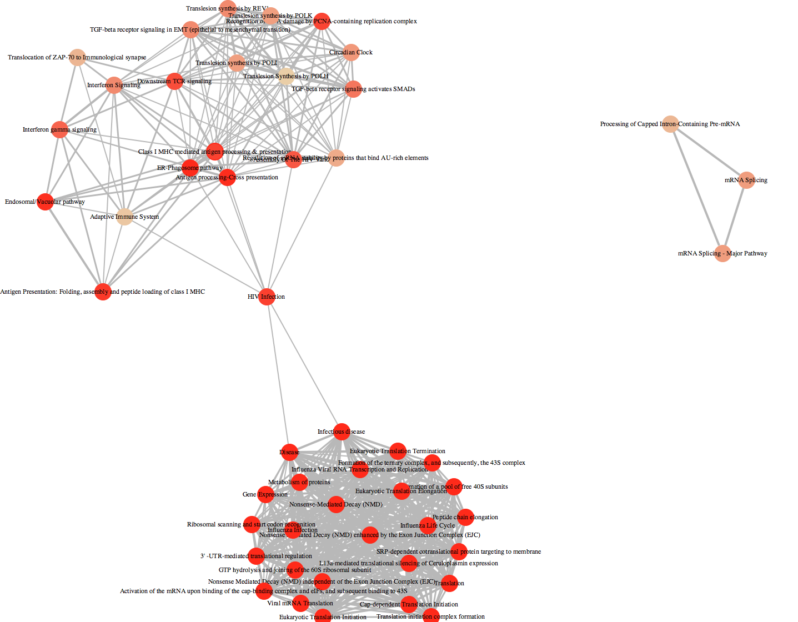

## Reactome enrichment analysis with DOSE

```{r results='hide', message=F}
require(ReactomePA)
```

```{r}
load("cache/gene.rda")
eg=bitr(gene, "ENSEMBL", "ENTREZID", "org.Hs.eg.db")[, "ENTREZID"]
rr <- enrichPathway(eg, readable=TRUE)
```

```{r fig.width=15, fig.height=10}
dim(summary(rr))
head(summary(rr)[,-8])
dotplot(rr)
```

```{r fig.width=8, fig.height=8, eval=F}
enrichMap(rr)
```



## Session info
```{r}
date()
sessionInfo()
```
