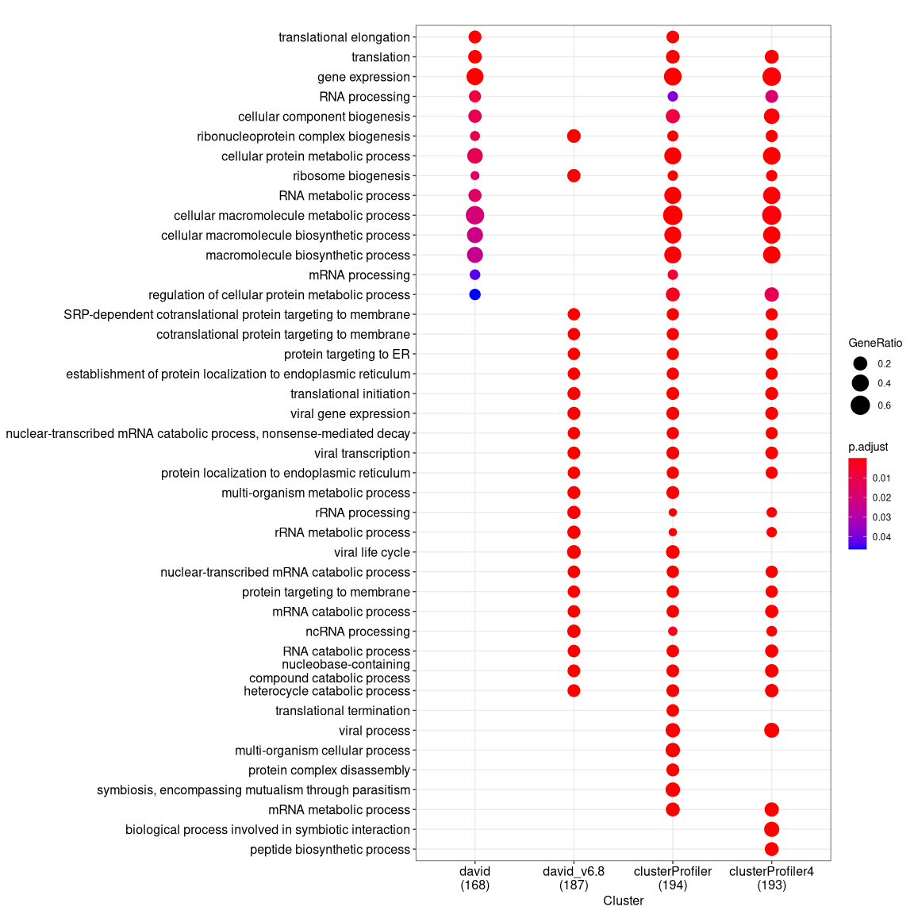

## GO (BP) enrichment with DAVID

Re-analyzed with David v6.8 (update date: May 2016).

``` r
library(DOSE)
library(RDAVIDWebService)
library(clusterProfiler)
library(enrichplot)
```

``` r
load("../cache/gene.rda")
david_v6.8_bp <- enrichDAVID(gene, idType="ENSEMBL_GENE_ID", annotation="GOTERM_BP_ALL", david.user="gcyu@connect.hku.hk")
```

## GO (BP) enrichment with clusterProfiler v4

``` r
eg=bitr(gene, "ENSEMBL", "ENTREZID", "org.Hs.eg.db")[, "ENTREZID"]
clusterProfiler_bp4 <- enrichGO(eg, ont="BP", OrgDb = org.Hs.eg.db, maxGSSize = NULL)
```

## Compare GO (BP) enrichment result obtained from DAVID and clusterProfiler

Load previous result with David v6.7 (update date: Dec 2009)

``` r
load("../cache/david_bp.rda")
```

Load previous result with clusterProfiler v2.3.6 (Jul 2015)

``` r
load("../cache/clusterProfiler_bp.rda")
```

``` r
f <- function(x) {
  x <- x[1]
  as.numeric(sub("^\\d+\\/", "", x))
}

d <- tibble::tribble(~Software, ~nTerm_enriched, ~nGene_Annotated, ~nGene_Background,
                "David_v6.7", nrow(david_bp), f(david_bp$GeneRatio), f(david_bp$BgRatio),
                "David_v6.8", nrow(david_v6.8_bp), f(david_v6.8_bp$GeneRatio), f(david_v6.8_bp$BgRatio),
                "clusterProfiler_v2", nrow(clusterProfiler_bp), f(clusterProfiler_bp$GeneRatio), f(clusterProfiler_bp$BgRatio),
                "clusterProfiler_v4", nrow(clusterProfiler_bp4), f(clusterProfiler_bp4$GeneRatio), f(clusterProfiler_bp4$BgRatio),
)
knitr::kable(d)
```

| Software            | nTerm\_enriched | nGene\_Annotated | nGene\_Background |
|:--------------------|----------------:|-----------------:|------------------:|
| David\_v6.7         |              14 |              168 |             14116 |
| David\_v6.8         |              31 |              187 |             16792 |
| clusterProfiler\_v2 |             222 |              194 |             18585 |
| clusterProfiler\_v4 |             249 |              193 |             18862 |

``` r
merge_result(list(david=david_bp, 
                  david_v6.8=david_v6.8_bp, 
                  clusterProfiler=clusterProfiler_bp, 
                  clusterProfiler4=clusterProfiler_bp4)) %>%
    dotplot(., showCategory=20)
```

<!-- -->

## Session info

``` r
date()
```

    ## [1] "Mon May 24 11:13:34 2021"

``` r
sessionInfo()
```

    ## R version 4.1.0 (2021-05-18)
    ## Platform: x86_64-pc-linux-gnu (64-bit)
    ## Running under: Arch Linux
    ## 
    ## Matrix products: default
    ## BLAS:   /usr/lib/libblas.so.3.9.1
    ## LAPACK: /usr/lib/liblapack.so.3.9.1
    ## 
    ## locale:
    ##  [1] LC_CTYPE=en_US.UTF-8       LC_NUMERIC=C              
    ##  [3] LC_TIME=en_US.UTF-8        LC_COLLATE=en_US.UTF-8    
    ##  [5] LC_MONETARY=en_US.UTF-8    LC_MESSAGES=en_US.UTF-8   
    ##  [7] LC_PAPER=en_US.UTF-8       LC_NAME=C                 
    ##  [9] LC_ADDRESS=C               LC_TELEPHONE=C            
    ## [11] LC_MEASUREMENT=en_US.UTF-8 LC_IDENTIFICATION=C       
    ## 
    ## attached base packages:
    ## [1] stats4    parallel  stats     graphics  grDevices utils     datasets 
    ## [8] methods   base     
    ## 
    ## other attached packages:
    ##  [1] enrichplot_1.12.0       clusterProfiler_4.0.0   RDAVIDWebService_1.28.0
    ##  [4] ggplot2_3.3.3           GOstats_2.58.0          Category_2.58.0        
    ##  [7] Matrix_1.3-3            AnnotationDbi_1.54.0    IRanges_2.26.0         
    ## [10] S4Vectors_0.30.0        Biobase_2.52.0          graph_1.70.0           
    ## [13] BiocGenerics_0.38.0     DOSE_3.18.0             magrittr_2.0.1         
    ## [16] conflicted_1.0.4        rvcheck_0.1.8           wget_0.0.1             
    ## [19] rmarkdown_2.8          
    ## 
    ## loaded via a namespace (and not attached):
    ##   [1] ggtree_3.0.0           fgsea_1.18.0           colorspace_2.0-1      
    ##   [4] ellipsis_0.3.2         qvalue_2.24.0          XVector_0.32.0        
    ##   [7] aplot_0.0.6            rstudioapi_0.13        farver_2.1.0          
    ##  [10] graphlayouts_0.7.1     ggrepel_0.9.1          bit64_4.0.5           
    ##  [13] scatterpie_0.1.6       fansi_0.4.2            splines_4.1.0         
    ##  [16] cachem_1.0.5           GOSemSim_2.18.0        knitr_1.33            
    ##  [19] polyclip_1.10-0        jsonlite_1.7.2         rJava_1.0-4           
    ##  [22] annotate_1.70.0        GO.db_3.13.0           png_0.1-7             
    ##  [25] ggforce_0.3.3          BiocManager_1.30.15    compiler_4.1.0        
    ##  [28] httr_1.4.2             lazyeval_0.2.2         assertthat_0.2.1      
    ##  [31] fastmap_1.1.0          tweenr_1.0.2           htmltools_0.5.1.1     
    ##  [34] tools_4.1.0            igraph_1.2.6           gtable_0.3.0          
    ##  [37] glue_1.4.2             GenomeInfoDbData_1.2.6 reshape2_1.4.4        
    ##  [40] DO.db_2.9              dplyr_1.0.6            fastmatch_1.1-0       
    ##  [43] Rcpp_1.0.6             vctrs_0.3.8            Biostrings_2.60.0     
    ##  [46] nlme_3.1-152           ape_5.5                ggraph_2.0.5          
    ##  [49] xfun_0.23              stringr_1.4.0          lifecycle_1.0.0       
    ##  [52] XML_3.99-0.6           zlibbioc_1.38.0        MASS_7.3-54           
    ##  [55] scales_1.1.1           tidygraph_1.2.0        RBGL_1.68.0           
    ##  [58] RColorBrewer_1.1-2     memoise_2.0.0          gridExtra_2.3         
    ##  [61] downloader_0.4         stringi_1.6.2          RSQLite_2.2.7         
    ##  [64] highr_0.9              genefilter_1.74.0      tidytree_0.3.4        
    ##  [67] BiocParallel_1.26.0    GenomeInfoDb_1.28.0    rlang_0.4.11          
    ##  [70] pkgconfig_2.0.3        bitops_1.0-7           evaluate_0.14         
    ##  [73] lattice_0.20-44        purrr_0.3.4            labeling_0.4.2        
    ##  [76] treeio_1.16.0          patchwork_1.1.1        shadowtext_0.0.8      
    ##  [79] cowplot_1.1.1          bit_4.0.4              tidyselect_1.1.1      
    ##  [82] GSEABase_1.54.0        AnnotationForge_1.34.0 plyr_1.8.6            
    ##  [85] R6_2.5.0               generics_0.1.0         DBI_1.1.1             
    ##  [88] pillar_1.6.1           withr_2.4.2            survival_3.2-11       
    ##  [91] KEGGREST_1.32.0        RCurl_1.98-1.3         tibble_3.1.2          
    ##  [94] crayon_1.4.1           utf8_1.2.1             viridis_0.6.1         
    ##  [97] grid_4.1.0             data.table_1.14.0      blob_1.2.1            
    ## [100] Rgraphviz_2.36.0       digest_0.6.27          xtable_1.8-4          
    ## [103] tidyr_1.1.3            munsell_0.5.0          viridisLite_0.4.0
