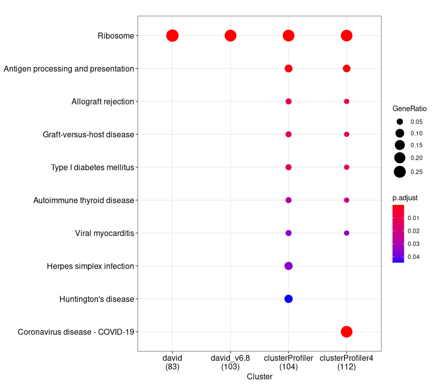

## KEGG enrichment with DAVID

``` r
library(DOSE)
library(RDAVIDWebService)
library(clusterProfiler)
library(enrichplot)
```

Re-analyzed with David v6.8 (update date: May 2016).

``` r
load("../cache/gene.rda")
david_v6.8_kegg <- enrichDAVID(gene, idType="ENSEMBL_GENE_ID", annotation="KEGG_PATHWAY", david.user="gcyu@connect.hku.hk")
```

## KEGG enrichment with clusterProfiler v4

``` r
eg=bitr(gene, "ENSEMBL", "ENTREZID", "org.Hs.eg.db")[, "ENTREZID"]
clusterProfiler_KEGG4 <- enrichKEGG(eg)
```

## Compare KEGG enrichment result obtained from DAVID and clusterProfiler

Load previous result with David v6.7 (update date: Dec 2009)

``` r
load("../cache/david_KEGG.rda")
```

Load previous result with clusterProfiler v2.3.6 (Jul 2015)

``` r
f <- function(x) {
  x <- x[1]
  as.numeric(sub("^\\d+\\/", "", x))
}

d <- tibble::tribble(~Software, ~nPathway_enriched, ~nGene_Annotated, ~nGene_Background,
                "David_v6.7", nrow(david_KEGG), f(david_KEGG$GeneRatio), f(david_KEGG$BgRatio),
                "David_v6.8", nrow(david_v6.8_kegg), f(david_v6.8_kegg$GeneRatio), f(david_v6.8_kegg$BgRatio),
                "clusterProfiler_v2", nrow(clusterProfiler_KEGG), f(clusterProfiler_KEGG$GeneRatio), f(clusterProfiler_KEGG$BgRatio),
                "clusterProfiler_v4", nrow(clusterProfiler_KEGG4), f(clusterProfiler_KEGG4$GeneRatio), f(clusterProfiler_KEGG4$BgRatio)
)
knitr::kable(d)
```

| Software           | nPathway_enriched | nGene_Annotated | nGene_Background |
|:-------------------|------------------:|----------------:|-----------------:|
| David_v6.7         |                 1 |              83 |             5085 |
| David_v6.8         |                 1 |             103 |             6879 |
| clusterProfiler_v2 |                 9 |             104 |             6895 |
| clusterProfiler_v4 |                 8 |             112 |             8105 |

``` r
merge_result(list(david=david_KEGG, 
                  david_v6.8 = david_v6.8_kegg,
                  clusterProfiler=clusterProfiler_KEGG, 
                  clusterProfiler4=clusterProfiler_KEGG4)) %>%
    dotplot(., showCategory=10)
```



## Session info

``` r
date()
```

    ## [1] "Mon May 17 17:12:27 2021"

``` r
sessionInfo()
```

    ## R version 4.0.5 (2021-03-31)
    ## Platform: x86_64-pc-linux-gnu (64-bit)
    ## Running under: Arch Linux
    ## 
    ## Matrix products: default
    ## BLAS:   /usr/lib/libblas.so.3.9.0
    ## LAPACK: /usr/lib/liblapack.so.3.9.0
    ## 
    ## locale:
    ##  [1] LC_CTYPE=en_US.UTF-8       LC_NUMERIC=C              
    ##  [3] LC_TIME=en_US.UTF-8        LC_COLLATE=en_US.UTF-8    
    ##  [5] LC_MONETARY=en_US.UTF-8    LC_MESSAGES=en_US.UTF-8   
    ##  [7] LC_PAPER=en_US.UTF-8       LC_NAME=C                 
    ##  [9] LC_ADDRESS=C               LC_TELEPHONE=C            
    ## [11] LC_MEASUREMENT=en_US.UTF-8 LC_IDENTIFICATION=C       
    ## 
    ## attached base packages:
    ## [1] stats4    parallel  stats     graphics  grDevices utils     datasets 
    ## [8] methods   base     
    ## 
    ## other attached packages:
    ##  [1] enrichplot_1.11.3       clusterProfiler_3.99.2  RDAVIDWebService_1.28.0
    ##  [4] ggplot2_3.3.3           GOstats_2.56.0          Category_2.56.0        
    ##  [7] Matrix_1.3-3            AnnotationDbi_1.53.2    IRanges_2.24.1         
    ## [10] S4Vectors_0.28.1        Biobase_2.50.0          graph_1.68.0           
    ## [13] BiocGenerics_0.36.1     DOSE_3.17.2             magrittr_2.0.1         
    ## [16] conflicted_1.0.4        rvcheck_0.1.8           wget_0.0.1             
    ## [19] rmarkdown_2.8          
    ## 
    ## loaded via a namespace (and not attached):
    ##   [1] fgsea_1.16.0           colorspace_2.0-1       ggtree_2.99.0         
    ##   [4] ellipsis_0.3.2         qvalue_2.22.0          XVector_0.30.0        
    ##   [7] aplot_0.0.6            rstudioapi_0.13        farver_2.1.0          
    ##  [10] graphlayouts_0.7.1     ggrepel_0.9.1          bit64_4.0.5           
    ##  [13] scatterpie_0.1.6       fansi_0.4.2            splines_4.0.5         
    ##  [16] cachem_1.0.4           GOSemSim_2.17.2        knitr_1.33            
    ##  [19] polyclip_1.10-0        jsonlite_1.7.2         rJava_0.9-13          
    ##  [22] annotate_1.68.0        GO.db_3.13.0           png_0.1-7             
    ##  [25] ggforce_0.3.3          BiocManager_1.30.14    compiler_4.0.5        
    ##  [28] httr_1.4.2             lazyeval_0.2.2         assertthat_0.2.1      
    ##  [31] fastmap_1.1.0          tweenr_1.0.2           htmltools_0.5.1.1     
    ##  [34] tools_4.0.5            igraph_1.2.6           gtable_0.3.0          
    ##  [37] glue_1.4.2             reshape2_1.4.4         DO.db_2.9             
    ##  [40] dplyr_1.0.6            fastmatch_1.1-0        Rcpp_1.0.6            
    ##  [43] vctrs_0.3.8            Biostrings_2.58.0      nlme_3.1-152          
    ##  [46] ape_5.5-1              ggraph_2.0.5           xfun_0.22             
    ##  [49] stringr_1.4.0          lifecycle_1.0.0        XML_3.99-0.6          
    ##  [52] zlibbioc_1.36.0        MASS_7.3-54            scales_1.1.1          
    ##  [55] tidygraph_1.2.0        RBGL_1.66.0            RColorBrewer_1.1-2    
    ##  [58] yaml_2.2.1             memoise_2.0.0          gridExtra_2.3         
    ##  [61] downloader_0.4         stringi_1.6.1          RSQLite_2.2.7         
    ##  [64] highr_0.9              genefilter_1.72.1      tidytree_0.3.4        
    ##  [67] BiocParallel_1.24.1    rlang_0.4.11           pkgconfig_2.0.3       
    ##  [70] bitops_1.0-7           evaluate_0.14          lattice_0.20-44       
    ##  [73] purrr_0.3.4            labeling_0.4.2         treeio_1.15.7         
    ##  [76] patchwork_1.1.1        shadowtext_0.0.8       cowplot_1.1.1         
    ##  [79] bit_4.0.4              tidyselect_1.1.1       GSEABase_1.52.1       
    ##  [82] AnnotationForge_1.32.0 plyr_1.8.6             R6_2.5.0              
    ##  [85] generics_0.1.0         DBI_1.1.1              pillar_1.6.0          
    ##  [88] withr_2.4.2            survival_3.2-11        KEGGREST_1.30.1       
    ##  [91] RCurl_1.98-1.3         tibble_3.1.1           crayon_1.4.1          
    ##  [94] utf8_1.2.1             viridis_0.6.0          grid_4.0.5            
    ##  [97] data.table_1.14.0      blob_1.2.1             Rgraphviz_2.34.0      
    ## [100] digest_0.6.27          xtable_1.8-4           tidyr_1.1.3           
    ## [103] munsell_0.5.0          viridisLite_0.4.0
